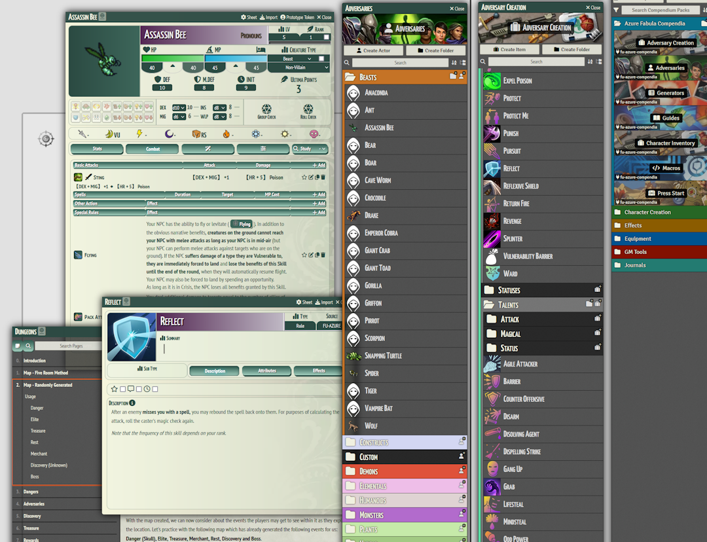

# Fabula Ultima Azure Compendia

A Foundry VTT compendia for the Fabula Ultima system.

`https://github.com/Azurelol/fu-azure-compendia/releases/latest/download/module.json`

## Features

The following compendiums are present at this time of writing:

- **Adversaries**: Generic NPCs of each creature type. (Note that while some of them have art, many don't)
- **Adversary Creation**: Items such as attacks, skills, spells for creating and/or customizing NPCs.
- **Generators**: Useful random tables for use during play such as rolling for random events or dangers.
- **Guides**: Journals with explanations on how to create adversaries, run dungeons or even a campaign.
- **Character Inventory**: Equipment and consumables for player characters!
- **Macros**: To be used during play.
- **Press Start**: An adventure module to help you get started by running the adventure for your group.

## Dependencies

The module is currently targeting the latest alpha releases of [Project FU](https://github.com/League-of-Fabulous-Developers/FoundryVTT-Fabula-Ultima/releases).

## Installation

1. Open the Foundry Setup screen and navigate to the "Add-on Modules" tab.
2. Click the "Install Module" button on the bottom left.
3. Paste the `Manifest URL` above.
4. Click "Install".
5. Launch the game world and go to `Game Settings > Manage Modules` and enable the module.

## Usage

Once installed, you can find the compendiums in your Compendiums tab. 

## Credits

I can't thank the developers of the unofficial Foundry VTT system, [Project FU](https://github.com/League-of-Fabulous-Developers/FoundryVTT-Fabula-Ultima) enough for their work and contribution to the very small community. I come from a software development background so I can only commend them for their regular update cadence for an open project like this. Without the system being where it is, I would not be running the game for my players or enjoying myself so much.

Since I have not contributed directly to their efforts, I feel the best I could do at the moment was to share the work I have been doing as a Game Master with the community: so that it may end up saving others even a little bit of time when they prepare for their own games.

This module has been made to be used by fellow game masters and the Fabula Ultima community at large. Since I can't draw in a straight line I have been using assets from the following royalty-free sources for icons, tokens and so on:

- [Game-icons.net](https://game-icons.net/)
- [OpenGameArt.org](https://opengameart.org)
- [Aekashics](http://www.akashics.moe/)

For specific assets I will try my best to keep an `ATTRIBUTION.MD` file on the same folder as the asset to attribute the creator directly. I have taken care to use assets under the creative commons (CC) license.
